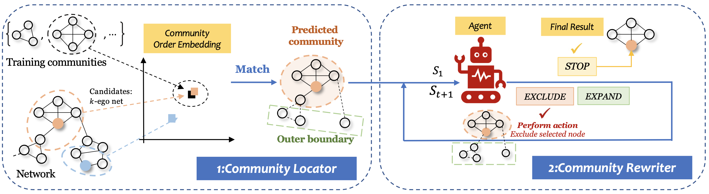
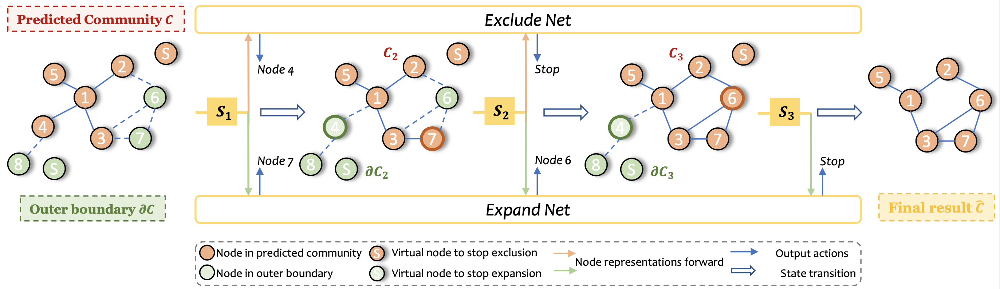

# KDD2022CLARE


This is our implementation for KDD 2022 Research Track Full Paper: **CLARE: A Semi-supervised Community Detection Algorithm**


Check out all the related resources: [[Paper](https://dl.acm.org/doi/10.1145/3534678.3539370 )]  [[Video](https://www.bilibili.com/video/BV1As4y1C7mX/ )] [[Slides](https://wxxshirley.github.io/slides/KDD2022CLARE.pdf )] !


In this paper, we study the semi-supervised community detection task and propose a novel framework: CLARE. It consists of two components, Community Locator and Community Rewriter.



## Cite
If you make advantage of CLARE in your research, please cite the following in your manuscript:
```
@inproceedings{wu2022clare,
  title={CLARE: A Semi-supervised Community Detection Algorithm},
  author={Wu, Xixi and Xiong, Yun and Zhang, Yao and Jiao, Yizhu and Shan, Caihua and Sun, Yiheng and Zhu, Yangyong and Philip S. Yu},
  booktitle={Proceedings of the 28th ACM SIGKDD Conference on Knowledge Discovery and Data Mining},
  year={2022},
  organization={ACM}
}
```


## What are in this Repository

This repository contains the following contents:

```
.
├── Locator                       --> (The folder containing Community Locator source code)
├── Rewriter                      --> (The folder containing Community Rewriter source code)
├── ckpts                         --> (The folder saving checkpoint files)
├── dataset                       --> (The folder containing 7 used datasets)
├── main.py                       --> (The main code file. The code is run through this file)
└── utils                         --> (The folder containing utils functions)

```
You have to create a `ckpts` folder to save contents.

> **Note**: we refactor the codes and release the newest version (v2) in Sep 2023. Therefore, `old_version` contains the CLARE v1.


## Datasets

Raw datasets are available at SNAP(http://snap.stanford.edu/data/index.html) and pre-processing details are explained in our paper.

> We select LiveJournal, DBLP and Amazon, in the **Networks with ground-truth communities** part.


We provide 7 datasets as below. Each of them contains a community file `{name}-1.90.cmty.txt` and an edge file `{name}-1.90.ungraph.txt`.

```
├── dataset
│   ├── amazon
│   ├── amazon_dblp
│   ├── dblp
│   ├── dblp_amazon
│   ├── dblp_lj
│   ├── lj
│   ├── lj_dblp
```


## Run our code

### Environmental Requirement

0. You need to set up the environment for running the experiments (Python 3.7 or above)

1. Install **Pytorch** with version 1.8.0 or later

2.  Install **torch-geometric** package with version 2.0.1

    Note that it may need to appropriately install the package `torch-geometric` based on the CUDA version (or CPU version if GPU is not available). Please refer to the official website https://pytorch-geometric.readthedocs.io/en/latest/notes/installation.html for more information of installing prerequisites.

    For example (Mac / CPU)

    ```
    pip install torch-scatter torch-sparse torch-cluster torch-spline-conv torch-geometric -f https://data.pyg.org/whl/torch-1.9.0+cpu.html
    ```


### Run the code

Execute the `main.py` file

```
python main.py --dataset=amazon  
```

Main arguments:

```
--dataset [amazon, dblp, lj, amazon_dblp, dblp_amazon, dblp_lj, lj_dblp]: the dataset to run
--conv_type [GCN, GIN, SAGE]: GNN type in Community Locator
--n_layers: ego-net dimensions & number of GNN layers
--agent_lr: the learning rate of Community Rewriter
```

  For more argument options, please refer to `run.py`
  
  
  
  
  
