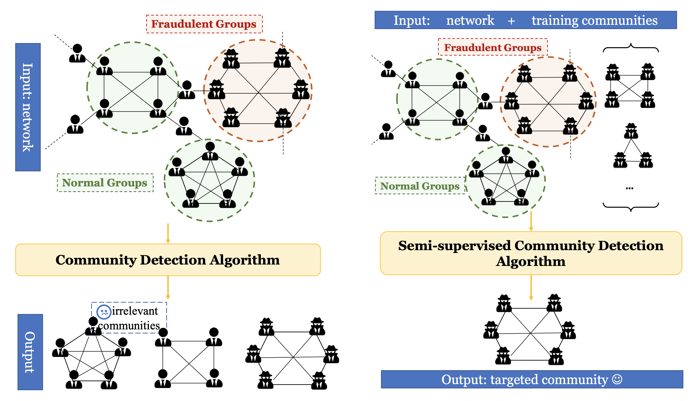
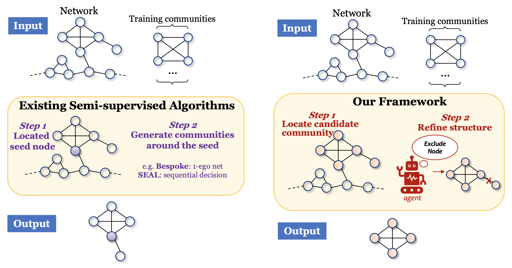

# KDD2022CLARE

> **Note**
> <span style="color:blue"> We release **a new implementation** on *September 2023* with **more elegant Locator implementation**. Please check out our new version 🎉</span>


This is the official implementation for KDD 2022 Research Track Full Paper: **CLARE: A Semi-supervised Community Detection Algorithm**


Check out all the related resources: [[📃 Paper](https://dl.acm.org/doi/10.1145/3534678.3539370 )]  [[🎬 Video](https://www.bilibili.com/video/BV1As4y1C7mX/ )] [[📝 Slides](https://wxxshirley.github.io/slides/KDD2022CLARE.pdf )] !


If you make advantage of CLARE in your research, please cite the following in your manuscript:
```
@inproceedings{wu2022clare,
  title={CLARE: A Semi-supervised Community Detection Algorithm},
  author={Wu, Xixi and Xiong, Yun and Zhang, Yao and Jiao, Yizhu and Shan, Caihua and Sun, Yiheng and Zhu, Yangyong and Philip S. Yu},
  booktitle={Proceedings of the 28th ACM SIGKDD Conference on Knowledge Discovery and Data Mining},
  year={2022},
  organization={ACM}
}
```

## Table of Contents

- [KDD2022CLARE](#KDD2022CLARE)
  - [Table of Contents](#table-of-contents)
  - [Paper Intro](#paper-intro)
  - [Run CLARE](#run-clare) 
    - [Environmental Requirement](#environmental-requirement)
    - [Run the code](#run-the-code)
    - [Sample log](#sample-log)


 ## Paper Intro

**Community Detection** algorithms fail to pinpoint a particular kind of community, *i.e.*, **targeted community**. For example, we may want to distinguish fraud groups from normal ones in transaction networks.

Therefore, some researchers tend to **semi-supervised** settings: utilize certain communities as training data to recognize the other similar communities in the network.

</img>

Existing methods can be generalized as **seed-based** (**first locate seed nodes, then develop communities around seeds**), which are quite sensitive to the quality of selected seeds. 
Therefore, we propose a novel **subgraph-based** method CLARE (**first locate candidate communities, then refine their structures**).
</img>


## Run CLARE


This repository contains the following contents:

```
.
├── Locator                       --> (The folder containing Community Locator source code)
├── Rewriter                      --> (The folder containing Community Rewriter source code)
├── ckpts                         --> (The folder saving checkpoint files)
├── dataset                       --> (The folder containing 7 used datasets)
├── main.py                       --> (The main code file. The code is run through this file)
└── utils                         --> (The folder containing utils functions)

```
You have to create a `ckpts` folder to save contents.
> For CLARE v1, the codes are archived in `old_version` folder.

For our experimental datasets, raw datasets are available at SNAP(http://snap.stanford.edu/data/index.html) and pre-processing details are explained in our paper.
We select LiveJournal, DBLP and Amazon, in the **Networks with ground-truth communities** part.
We provide 7 datasets. Each of them contains a community file `{name}-1.90.cmty.txt` and an edge file `{name}-1.90.ungraph.txt`.
If you want to run on your **own datasets**, you have to convert your own data into our format, *i.e.*, **a community file** where each line contains a unique community and **an edge file** where each line contains an edge.


### Environmental Requirement

0. You need to set up the environment for running the experiments (Python 3.7 or above)

1. Install **Pytorch** with version 1.8.0 or later

2.  Install **torch-geometric** package with version 2.0.1

    Note that it may need to appropriately install the package `torch-geometric` based on the CUDA version (or CPU version if GPU is not available). Please refer to the official website https://pytorch-geometric.readthedocs.io/en/latest/notes/installation.html for more information of installing prerequisites.

> Our experimental environment for your information:
> torch == 1.13.0
> torch-geometric == 2.3.1


### Run the code

Execute the `main.py` file

```
python main.py --dataset=amazon  
```

Main arguments (for more argument options, please refer to `main.py`):

```
--dataset [amazon, dblp, lj, amazon_dblp, dblp_amazon, dblp_lj, lj_dblp]: the dataset to run
--num_pred / num_train / num_val: the numbers for prediction, training, and validation
--locator_epoch: number of epochs to train Community Locator (default setting 30)
--n_layers: ego-net dimensions & number of GNN layers (default 2)
--agent_lr: the learning rate of Community Rewriter
--max_step: the maximum operations (EXPAND/EXCLUDE) of rewriting a community
```


For better training the Community Rewriter, you are encouraged to set a larger `n_episode` and a larger `n_epoch`.


### Sample log

We provide an runing example on `Amazon` dataset

```
= = = = = = = = = = = = = = = = = = = = 
##  Starting Time: 2023-09-08 15:16:31
Namespace(agent_lr=0.001, comm_max_size=12, commr_path='', dataset='amazon_small', device='cuda:0', gamma=0.99, generate_k=2, gnn_type='GCN', hidden_dim=64, locator_batch_size=256, locator_epoch=30, locator_lr=0.001, margin=0.6, max_step=4, n_episode=10, n_epoch=1000, n_layers=2, num_pred=1000, num_train=90, num_val=10, output_dim=64, seed=0, writer_dir='ckpts/amazon_small/20230908-151631')
[AMAZON_SMALL] #Nodes 6926, #Edges 17893, #Communities 1000
Finish loading data: Data(x=[6926, 5], edge_index=[2, 35786])

Split dataset: #Train 90, #Val 10, #Test 900

Community Locator init ... 
Community Locator finish initialization!

Training Order Embedding ... 
***epoch: 0001 | ORDER EMBEDDING train_loss: 24.05397 | cost time 1.11s
···
***epoch: 0030 | ORDER EMBEDDING train_loss: 9.37016 | cost time 0.447s
Order Embedding Finish Training!

***Generate nodes embedding from idx 0 to 4096
***Generate nodes embedding from idx 4096 to 6926

Start Matching ... 
[Generate] Pred size 1000, Avg Length 8.2520

P, R, F, J AvgAxis0:  [0.82229885 0.72814998 0.74318908 0.63587454]
P, R, F, J AvgAxis1:  [0.75142701 0.72196902 0.72065251 0.64863271]
AvgF1: 0.7319 AvgJaccard: 0.6423 NMI: 0.6608 Detect percent: 0.6332
[Eval-Epoch100] Improve f1 0.0255, improve jaccard 0.0376, improve new_nmi 0.0338
···
[Eval-Epoch1000] Improve f1 0.0613, improve jaccard 0.1028, improve new_nmi 0.1124
Load net from ckpts/amazon_small/20230908-151631/commr_eval_best.pt at Epoch919
[Rewrite] Pred size 1000, Avg Length 9.0610
P, R, F, J AvgAxis0:  [0.88020826 0.78469454 0.81072351 0.73091315]
P, R, F, J AvgAxis1:  [0.77871547 0.7972597  0.77916445 0.74012245]
AvgF1: 0.7949 AvgJaccard: 0.7355 NMI: 0.7507 Detect percent: 0.6672
## Finishing Time: 2023-09-08 15:18:58
= = = = = = = = = = = = = = = = = = = = 
```


📮 If your still have other questions, you can open an issue or contact the authors via e-mail.

  
